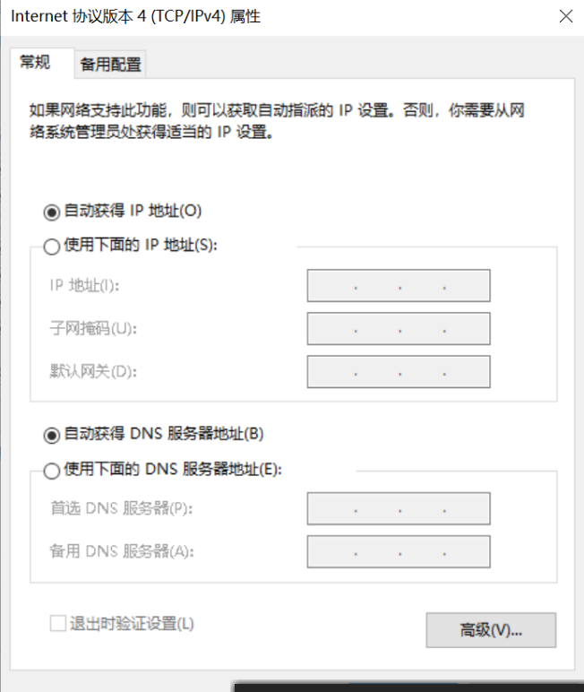

# HTTP 入门

1. 概念

   1. `www = URL + HTTP + HTML`
   2. URL

      - URL 就是发请求
      - 协议 + 域名/IP + 端口号 + 路径 + 查询字符串 + 锚点
      - HTTPS 默认端口`443`

      | 啥         | memo                                        |
      | ---------- | ------------------------------------------- |
      | 协议       | 根据 http / https 协议里规定                |
      | IP / 域名  | 找到 xxx 地址的机子                         |
      | 端口号     | xxx 端口 :80 / :443                         |
      | 路径       | 然后跟他说 这个路径里的 html 给俺！！的意思 |
      | 查询字符串 | 如果需要传一点参数的话 这里加               |
      | 锚点       | 跟服务器木有关系 表示的时候的锚点罢了       |

   3. IP

      - Internet Protocol `互联网协议`
      - 主要约定了 2 件事情
        1. `如何定位一台设备` ★ 今天的部分
        2. 如何封装数据报文，以跟其他设备交流
      - IP 分为内网和外网
        - 如何获取`外网IP`
          - 向电信租用宽带
          - 调制解调器 (光)猫
          - 路由器 然后用电脑手机分别连接路由器
          - 只要路由器通过猫连上电信的服务器 那么路由器上就会有个`外网IP`
          - 这个外网 IP 就是`这个家`在`互联网`里的地址
          - ※如果重启路由器 可能会被重新分配到新的`外网IP` 想要固定自己的外网 IP 的话需要`课金`
          - 怎么查询自己的外网 IP？
            - `ip138.com` 查询 其实别的网站也有这个查询功能 随意
          - 那么连接路由器的移动设备的 IP 又是什么呢？ -> `内网IP`
        - 如何获取`内网IP`
          - 如何查询？
            - `ipconfig`
            - `IPv4 Address 192.168.xxx.xx` 就是这台设备的`内网IP`
            - `Default Gateway 192.168.xxx.1` 就是这个路由器的`内网IP`
          - 反正就是路由器会给链接设备分发不同的`内网IP`
        - 那么路由器有哪些功能？
          - 路由器有两个 IP `内网IP`和`外网IP` //废话 它要连互联网要连家里的 当然需要两个
          - 内网设备可以互相访问
          - 但是不能直接访问外网 需要路由器中转
          - 外网设备想发内容到内网的话也需要中转
        - 几个特殊的 IP `需要背`
          - `127.0.0.1` 表示自己 规定死的
          - `localhost` 通过 hosts 指定为自己 默认就是`127.0.0.1`
            - `C:\Windows\System32\drivers\etc`自己去改着玩
          - 0.0.0.0 不表示任何设备 现在不学

   4. 端口

      - 一台机器可以提供很多服务 一共有 `65535` 个端口 目前基本够用
      - 每个服务一个号码 这个号码就叫端口号 `port`
        - 要提供`HTTP`服务最好用`80`端口
        - 要提供`HTTPS`服务最好用`443`端口
        - 要提供`FTP`服务最好用`21`端口
      - 我 TM 怎么知道应该用哪个端口？
        - [wiki 端口](https://zh.wikipedia.org/wiki/TCP/UDP%E7%AB%AF%E5%8F%A3%E5%88%97%E8%A1%A8#0.E5.88.B01023.E5.8F.B7.E7.AB.AF.E5.8F.A3)
      - 重要的规则
        - `0 ~ 1023`我们不能用 系统用的 真的要用的话需要`管理者权限`
        - `hs -c-1 -p 1234` 其他端口随便用
        - 端口会被占用的 重复会报错

   5. 域名

      - IP 太难记 于是出了这么个东西 域名
      - 怎么通过域名查 IP？
        - `ping baidu.com`
      - `一个域名可以对应不同IP`
        - 因为机器突然挂掉就杯具了 学名 `均衡负载`
        - 按照地域来分是大厂的正常手段
      - `一个IP可以对应不同域名` 因为域名是要钱的 穷 学名 `共享主机`
      - 域名和 IP 如何对应的？-> `DNS`
        - `Domain name system`
        - 一个栗子
          1. 在`浏览器`输出`xxx.com`
          2. `浏览器`会问 电信/联通 提供的`DNS服务器` `xxx.com`是啥`IP`
             - 在这里 ↓ 可以设访问的 DNS 服务器地址哟
             - 
             - `nslookup Domain`
          3. `浏览器`就会向`返回来的IP`地址的`80 http / 443 https`端口`发送`查看其首页的`请求`
             - 可以通过开发者工具 `network`那边看`remote address`/`domain`
      - 科普
        - www.xxx.com != xxx.com
        - com 是顶级域名 Company 的意思 org 是非营利组织的意思
        - xxx.com 2 级域名
        - www.xxx.com 3 级
        - 他们是父子关系 不是同一个东西
        - 举个栗子
          - `github.io`是 2 级 他把 3 级域名`xxx.github.io`给我们用
        - 一般网站上`www开头`其实是历史原因 并不是必须的
      - 如何请求不同的页面
        - 请求地址不同就可以了`域名/`后面的
        - `https://developer.mozilla.org/zh-CN/docs/Web/HTML`
        - `https://developer.mozilla.org/zh-CN/docs/Web/CSS`
      - 同一页面不同内容
        - 参数给的不一样返回值就会不一样 `?`后面的
        - `http://www.baidu.com/s?wd=hi`
        - `http://www.baidu.com/s?wd=hello`
      - 同一个页面不同位置
        - 后面加锚点就好`#`后面的
        - `https://developer.mozilla.org/zh-CN/docs/Web/CSS#参考书`
        - `https://developer.mozilla.org/zh-CN/docs/Web/CSS#教程`
        - 注意`锚点不会传给服务器` 会被自动无视

   6. HTTP 协议

      - 基于 TCP 和 IP 两个协议

      - curl 命令

        - 可以发送 HTTP 请求
          - `curl https://baidu.com`
          - `curl -v https://baidu.com` 详细点
          - `curl -s -v -- https://www.baidu.com`
          - 举个栗子 - `curl -v https://www.google.com`
            1. url 有时候会被 curl 工具重写 `Rebuilt URL to: ...`
            2. 先请求 DNS 获得 IP 貌似看不到过程 只能看到结果`Trying 216.58.197.132:443...`
            3. 进行 TCP 连接
               - `TCP_NODELAY set`
               - `Connected to www.google.com (216.58.197.132) port 443 (#0)`
            4. 成功以后 发送 HTTP 请求
               - ```
                 GET / HTTP/2 //获取 / 协议
                 Host: www.google.com //访问的域名 因为一个IP可以对应多个域名
                 User-Agent: curl/7.65.3 //用啥访问的
                 Accept: _/_ //我期待的返回内容 这里表示随便啥都行
                 ```
            5. 请求内容看一眼
            6. 响应内容看一眼
            7. 响应内容结束后，关闭 TCP 连接(看不出来的)
            8. 真正的结束
