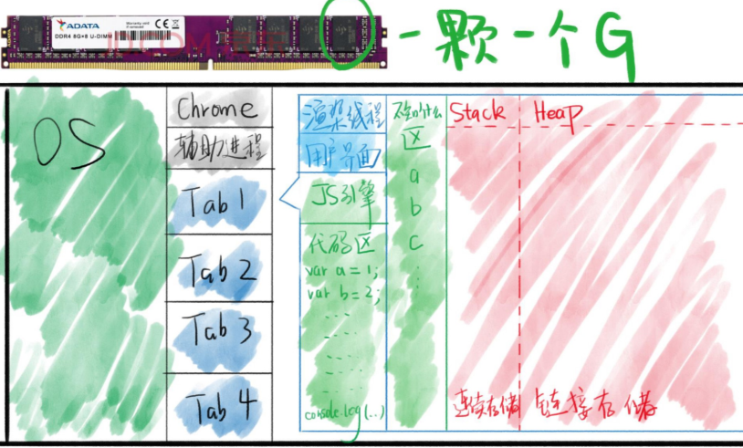

# JS 概论

1. JS 引擎
   - JS 引擎举例
     - Chrome V8 引擎 c++
     - 网景是 SpiderMonkey c++ 后被 Firefox 使用
     - safari javaScriptCore
     - IE Chakra(JScript9)
     - Edge 2020 开始就用谷歌的啦
     - NodeJs V8
   - 主要功能
     - 编译 把 JS 代码翻译为机器能够执行的字节码或机器码 //编译原理
     - 优化 编译阶段代码优化 很难
     - `执行`
     - 垃圾回收 把 JS 用换的内存回收
2. JS 的执行
   - 准备工作
     - 提供 API window / document / setTimeout
     - 这些不是 JS 自身的功能 只是浏览器提供的 说你这么写可以用他们
     - 这些功能称之为运行环境 runtime env
3. 关于内存

   1. 
      - 红色区域
        - 存放数据的 我们目前只研究这个
        - 不存变量名
        - JS 引擎不一样 分配的算法当然也可能不一样
        - 上面的图并不完整
        - `调用栈` `任务队列`等等没画
      - Stack 栈 和 Heap 堆
        - 就是红色那块的总称
        - 需要数据结构的知识后面讲
        - 特点
          - Stack 顺序存放
          - Heap 随机
        - 规律
          - 非对象在 stack
          - 对象在 heap but heap 的地址会在 stack 里

4. 在线学习
   1. https://wangdoc.com/javascript/
5. 语法

   1. 表达式和语句

      - 区别
        > 语句主要为了进行某种操作，一般情况下不需要返回值；
        > 表达式则是为了得到返回值，一定会返回一个值。凡是 JavaScript 语言中预期为值的地方，都可以使用表达式。比如，赋值语句的等号右边，预期是一个值，因此可以放置各种表达式。
      - 概念
        - > 语句以分号结尾，一个分号就表示一个语句结束。多个语句可以写在一行内。`var a = 1 + 3 ; var b = 'abc';`
        - > 分号前面可以没有任何内容，JavaScript 引擎将其视为空语句。`;;;`表示 3 个空语句。
        - > 表达式不需要分号结尾。一旦在表达式后面添加分号，则 JavaScript 引擎就将表达式视为语句，这样会产生一些没有任何意义的语句。
        ```javascript
        1 + 3;
        ("abc");
        ```
        - 上面两行语句只是单纯地产生一个值，并没有任何实际的意义。

   2. 大小写敏感

   3. 空格 回车

      - 空格只要不影响断意 随便加
      - `return`后面不能加回车

   4. 标识符

      - 取名字用到的符号
      - 规则
        - 第一个字符，可以是 `Unicode字母/$/_/中文`
        - 后面的还可以有`数字`

   5. 注释

      - good
        - 踩过的坑
        - 奇怪的代码
      - bad
        - 除了上面 good 的废话

   6. if

      - `{}`在语句只有一句的时候可以省略
      - 一道搞笑的题目 让你知道对其的重要性
        ```javascript
        a = 1;
        if (a === 2) console.log("a");
        console.log("a等于2"); //a等于2
        ```
        - 因为第一行的大括号可以省略 所以 因为`a!==2`所以第一句不执行
        - 但是第二句子缩进看起来跟上面那句是一个 block 的其实没关系 看起来而已 所以正常执行
      - Temp1
        ```javascript
        if (表达式) {
          语句;
        } else if (表达式) {
          语句;
        } else {
          语句;
        }
        ```
      - Temp2
        ```javascript
        function fn() {
          if (表达式) {
            return 表达式;
          }
          if (表达式) {
            return 表达式;
          }
          return 表达式;
        }
        ```

   7. switch

      - `break`
        - 大部分时候不能省略 否则会贯穿
        - 很多新的语言默认自带`break`

   8. 问号冒号表达式 `表达式1？表达式2:表达式3`

   9. `&&` 要么取第一个假值，要么最后一个

      - eg `console && console.log && console.log(xxx)` 貌似是为了 IE

   10. `||` 要么取第一个真值，要么最后一个

       - eg `a = a || 100` 如果`a`不存在就等于`100`不然啥都不做 保底值的概念

   11. while
       - `while(表达式){语句}`

   12. for

      - 语法
        - `for(语句1;表达式2;语句3){循环体}`
        1. 语句 1 执行
        2. 表达式 2 判断
           - true => 执行循环体 => 执行语句 3 除非有 break 啥的
           - false => 退出循环
      - break 退出循环/continue 跳一次循环 //CNM 老子不玩了啊 俺这次 PASS 的概念
