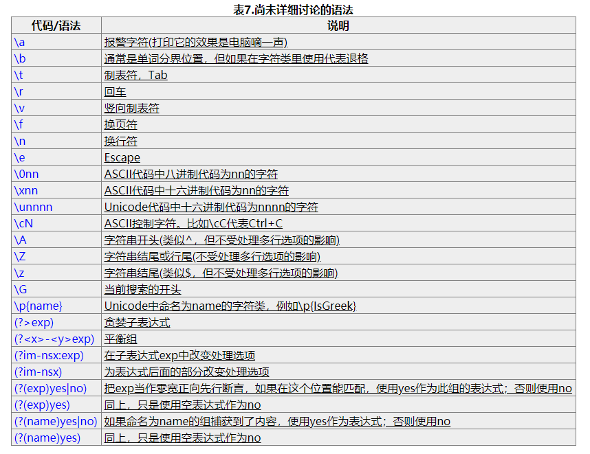

## 参考

- [正则表达式 30 分钟入门教程](https://deerchao.cn/tutorials/regex/regex.htm)
- [常用的正则](https://segmentfault.com/a/1190000010756605)

## 感想

- 感觉需要用的时候有 2 种
  1.  自己平时用的时候
      1. 比如整形一下 方便自己看 换个行啥的
      2. 比如想在一个函数里面插一个变量的时候啥的
  2.  业务上需要用到的时候
      1. 有固定格式的东西
         1. 密码
         2. 日期
         3. 中文？
         4. 身份证
         5. 是不是只有字母加数字之类的
         6. 文件后缀
         7. mail 地址
         8. 手机
         9. 邮编号码
         10. URL
         11. IPv4
      2. 别的需求
- 总之
  1. 至少看见不会慌了
  2. 基本上就是需要定位的东西很多需要一下子可以全部被修改的话 可以用正则
  3. 有固定格式的要求的 那就会需要用的 check 可以靠正则来 check
  4. 要用的时候不需要背 搜索就好
  5. 以上

## 概要

1. 啥是正则表达式？
   - 就是处理文字时,选想选的文字的时候用的 方便的东西
2. [正则表达式引擎特性对比](https://deerchao.cn/tutorials/regex/diffs.html)

## 基本语法

### 规则

1. 英文字母大小写不区分

### 对象

> 就是选择一个什么？的概念

1. `.` : 匹配除了换行符以外的任意字符 最强 ww
2. `\w` : 字母 / 数字 / 下划线 / 汉字等
3. `\d` : 数字
4. `\s` : 任意的空白符(空格 / 制表符(Tab) / 换行符 / 中文全角空格等)
5. 自己定规则
   1. [aeiou]
   2. [a-z0-9]

### 反义

> 不是 xxx 的一种选择方法 基本就是`大写`和`^`

- `\W` >非\w
- `\S` >非\s
- `\D` >非\d
- `\B`
- `[^x]`
- `[^aeiou]`

### 回数

> 前面的指令重复几次？的概念

1. `*` : `0 => ∞`
2. `?` : `0 => 1`
3. `+` : `1 => ∞`
4. `{n}` : `n`
5. `{n,}` : `n => ∞`
6. `{n,m}` : `n => m`
   > 上面的是贪婪匹配 就是尽量多的匹配 比如 ababab 单词 但是我们想要第一个 ab 的时候可以用懒惰匹配
7. `*?`
8. `+?`
9. `??`
10. `{n,m}?`
11. `{n,}?`

### 位置

> 跟选择差不多不过 次元不一样 不是按内容来指定 按结构的位置来指定

1. `\b` : 单词的开头 / 结尾，也就是单词的分界处
   1. > 单词就是 2 个以上连着的\w
   2. **↑↑↑ 　超级重要！！！！！**
2. `^` : 字符串的开始
3. `$` : 字符串的结束

### 字符转义

> 那些有语义的语法需要指定的时候加上`\`就好

1. `\.`
2. `\*`

### 分歧条件

> 要么 A 要么 B 的时候用的

- `|`

### 分组

> 多方便呀

- `()`
- 用 `/n` 可以调

### 分组还提供了很多方法

#### 名字分组

> 就是自己可以给组定一个名字然后去调

- 定义方法
  - `(?<name>exp)`
  - `(?'name'exp)`
- 使用方法
  - `\k <name>`
  - `\k 'name'`

#### 别的

> 懒得写了 到时候去查 反正就是
> 匹配 exp 前面的`?=exp` / 后面的`?<=exp`
> 匹配后面跟的不是 exp 的`?!exp` / 前面跟的不是 exp 的`?<!exp`
>
> 有个比较神奇的不知道怎么用的是`(?:exp)` : 匹配 exp,不捕获匹配的文本，也不给此分组分配组号

### 还有些别的到时候自己去看吧

